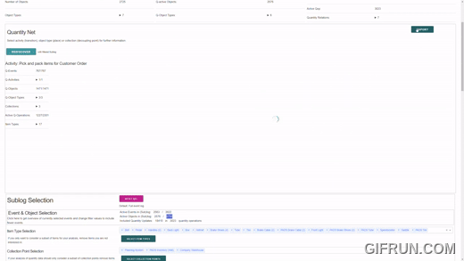

## Readme Still in Progress

# QRPM
This interactive Quantitative Process Mining-Tool (QRPM) allows for the basic analysis of quantity event logs (QELs) which extend the OCEL 2.0 standard.
Its functionalities encompass:
- the determination of the quantity state prior to every event as described in [1], 
- the discovery and visualisation of the corresponding quantity net (q-net) [1],
- functionalities for filtering the QEL and rediscovering the q-net based on the filtered log,
- basic processing and visualisations of the quantity data based on the (filtered) QEL, and
- functionalities for exporting the quantity data (csv), charts (png), and q-net (svg).
The demo data added to the repository (uses for the evaluation in [1]) was added to the repository to give the user an 
idea of the expected input format and the functionalities of the tool.

The following screencast shows the basic functionalities of QRPM:



[Full Screencast Video](https://youtu.be/1ipKGYq3LeE)

QRPM © 2024 by Nina Graves is licensed under CC BY 4.0. To view a copy of this license, visit http://creativecommons.org/licenses/by/4.0/

## Getting Started

### Installation
The repository uses poetry for dependency management. If you do not have poetry installed, you can install it by running:
```pip install poetry```
Installation of the full tool has to occur in four steps:
1. Manually install PyGraphviz (needed for the visualisation of the underlying Q-net): https://gitlab.com/graphviz/graphviz/-/package_files/6164164/download
2. To install PyGraphviz in the poetry environment, you must follow the instructions on https://pygraphviz.github.io/documentation/stable/install.html
For Windows this means you must run:
```poetry run pip install --config-settings="--global-option=build_ext" `
              --config-settings="--global-option=-IC:\Program Files\Graphviz\include" `
              --config-settings="--global-option=-LC:\Program Files\Graphviz\lib" `
              pygraphviz```
3. Run ```poetry install``` again to synchronise the dependencies.

### Running the Tool
After ensuring all dependencies are installed, you can run the tool by executing the ```qrpm_app.py``` file in qrpm/app.

## Functionality
QRPM is a tool for the analysis of quantity event logs (QELs) which extend the OCEL 2.0 standard [2]. 
All quantity-related functionalities (marked *qr*) only show if the uploaded event log also contains quantity-related information; 
log filtering and (re-)discovery also work with normal OCEL 2.0s. 
Immediately after uploading a valid event log, QRPM 
1. determines the quantity state prior to every event, 
2. shows some basic statistics about the log, and 
3. discovers and visualises the quantity 
net (q-net) as described in the paper. 

You can zoom into the q-net, click on nodes to get information on the process elements (activities, object types, 
collection points), and export the displayed q-net as svg.
Beneath the q-net, there is a section for QEL filtering -- the user can expand the "Event & Object Selection"-Section.
Below the sublog creation, you find two tabs for processing and exporting data on the quantity state (Tab 1) and the quantity operations (Tab 2).
Each of these tabs includes various visualisations and tables that can be used for an interactive analysis of the QEL.
All Figures can be downloaded as PNGs by clicking on the camera icon in the top right corner of the figure.

### Sublog Creation
The user can filter the QEL by selecting a subsets of events, objects, item types and collection points.
The selection of item types and collection points merely removes the corresponding quantity updates/quantity operations 
of the QEL but not the connected events.

By selecting a subset of events and/or objects the user removes the corresponding event to object relations from the QEL.
This means that if, for example, all objects of a type are removed, the corresponding events are only also removed if 
they are not connected to any other object still remaining in the log.
Similarly, if you filter for a subset of events, ALL objects associated with these events also remain in the log -- even 
if the subset of events you decide to keep is specified by a selection of a subset of objects.
QRPM offers the filtering of events based on the following criteria:
- time frame
- activity
- event attributes
- object types involved in the event
- events connected to object with specific attributes
- events with a specific number of objects of a particular object type
- events executed a specific number of times by the same object of a particular object type
- events with a specific total number of involved objects
- (*qr*) quantity active/inactive events
- (*qr*) events quantity active for a set of collection points
- (*qr*) events quantity active for a set of item types
- (*qr*) events executed during a specific quantity state

Objects can be filtered based on the following criteria:
- object types
- objects of a specific object type executing a specific activity
- objects of a specific object type executing a specific activity a specific number of times.

By applying multiple filters, the user can create a sublog that only contains the events and objects that meet all the specified criteria.
By clicking "Reset QEL" all filters are reset and the original QEL is restored.
Only quantity operations connected to the selected events, collection points and item types are considered in the quantity operations tab.

### Quantity Data Processing (*qr*)
The included quantity data is can be analysed by two perspectives: the quantity state during before and after event 
executions and the quantity operations changing the item levels in events.

#### Quantity State
The first tab deals with the quantity state at event executions.
The main element of this tab is the chart showing the quantity state development and the table below, giving information on the item levels of the different collection points.
The quantity state is determined using the full log and the exclusion of events with active quantity operations does not affect determination of the quantity state.
However, when the user filters the log, the quantity state development chart will highlight the events included in the sublog in an additional subfigure added to the top.
The user can also choose to display the quantity state development of the full log or the sublog by selecting the corresponding option in the "Quantity State Development Display" button.
When selecting the sublog, the quantity state of events included in the log are connected without showing the impact of events that occurred inbetween.
While the top chart and the table work with the full log, everything beneath the table only includes the quantity states of the sublog.
The user has the following options of processing the quantity state:
- Perspective: Switching between "Item Levels" (can be positive or negative) and Item Associations (no distinction between positive and negative, just absolute values).
- Pre/Post Item Level: Item levels associated with every event either before or after the event execution.
- Property: Only consider positive/negative item levels.
- Item Type Aggregation: Aggregating the values of all included item types (selected below) to one value per event and collection point, e.g., for capacity analyses.
- Collection Point Aggregation: Aggregating the values of all included collection points (selected below) to one value per event and item type, e.g., for consideration of an overall quantity state.
- Item Types: Selecting the item types to be considered in the analysis.
- Collection Points: Selecting the collection points to be considered in the analysis.

The processed data used for the charts based on the processed data of the sublog can be seen and exported by clicking "View Data" beneath the configuration options.

##### Quantity State at Execution
Based on the processed quantity state data, the user can consider the quantity state at the execution of events of a selected activity.
This analysis can refer to all collection points (default) or a selected collection point -- the same applies for the item types.
By merely limiting to an activity, the user gets information on the quantity state at the execution of the selected activity independently whether the selected item type is involved in the event or not.
By selecting "Only active item types", the tables and charts only include data for a specific item type, if the event is quantity active for this item type.
The following tables and charts are available for the analysis using the selected data:
- Descriptive Statistics (Table + Boxplot) of the distribution of the quantity state. Distributions refer to all entries of the same activity, collection point or item type (max 20 item types).
Other charts only displayed when the user narrows down data ("Frequency of Item Level at Execution of Collection Point" requires a selected collection point):
- Item Level at Event Execution: A bar chart showing the item levels of all of the selected collection points and item types at the execution of every event of the selected activity.
- Frequency of Item Level at Execution of Collection Point: Histogram of the item levels of the selected collection point at the execution of the selected activity.
- Item Levels before and after Event Execution per Item Type (only displayed if pre-event item levels are selected): Boxplots showing the item levels of the selected item types before and after the execution of the selected activity.

The options of display and processing are derived from the typology of inventory management processes; the focus lies on the patterns in the execution of item type-active executions based on quantity levels (small stock s) and the quantity-dependent execution of quantity operations (Large stock S).  

#### Quantity Operations
The second tab should support the processing and analysis of the quantity operations executed by events in the log for 
the identification of patterns.
Without processing the data, all visualisations and tables in this section refer to all quantity operations of the events selected in the filtered log.
The user can perform some basic processing of the quantity operations of the sublog:
- Perspective: Switching between "Quantity Changes" (distinction between additions and removals) and Item Movements (the total number of items moved (absolute value)).
- Adding/Removing: The data can be projected to only the adding/removing quantity operations.
- Included Instances: Consider all quantity operations, only the active ones (the full quantity operations of all quantity operations with at least one non-zero value), or only active quantity updates (replaces zeros with NANs).
- Item Type Aggregation: Aggregating the values of all included item types (selected below) to one value per event and collection point.
- Collection Point Aggregation: Aggregating the values of all included collection points (selected below) to one value per event and item type.
- Item Types: Selecting the item types to be considered in the analysis.
- Collection Points: Selecting the collection points to be considered in the analysis.

As for the quantity state, the data can be viewed and exported by clicking "View Data" beneath the configuration options.
The first three charts give a general overview of the selected quantity operations without focussing on specific events/collection points/item types:
- Activity Impact on Collection Point's Item Levels: A scatter plot showing the number of quantity operations / number of items moved by the different activities for each of the two directions (adding/removing). The axes show the collection points and the item types (max 20 item types). To increase readability, random jitter was added to every point (i.e., the distance from the center point has no meaning).
- Active Quantity Operations: Depicts the number of active quantity operations for the different activities and collection points.
- Direction of Quantity Changes: Shows the number of quantity operations adding items, removing items or both per activity and collection point.

At the bottom of the page, the user can go into more detail for a specific quantity relation (activity & collection point) using the following visualisations:
- Depicting the quantity operations of the selected activity and collection point over time (takes long to render if the considered period is long).
- Distribution of active item types and item type combinations.
- Descriptive Statistics (Table + Boxplot) of the distribution of the quantity updates.
- Time between quantity operations (if you only want to consider non-zero quantity updates, select "Active Qty Updates" in the processing options).
- Mean Quantity Changes: Shows the mean quantity changes (per month, per day, per event, per addition/removal) for every item type (especially interesting for collection points for considering turnovers).
- Mean time between additions and removals: Shows the mean time between additions and removals for every item type. 

There are some visualisations to consider the quantity updates of a selected item type:
- Quantity Updates per event
- Distribution of the quantity updates of the selected item type (boxplot)
- Time between active quantity updates of the selected item type
- Distribution of the time between active quantity updates of the selected item type (boxplot)

## References
[1] in review //
[2] https://www.ocel-standard.org/ //
[3] publication in progress //


